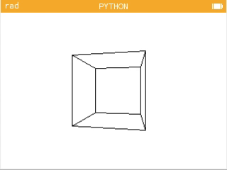
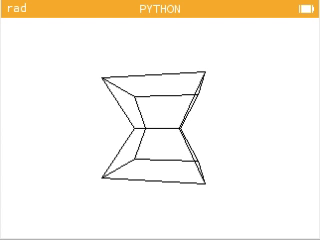

# NumWorks 3D Wireframe

A 3D wireframe renderer for the NumWorks programmable calculator, written in MicroPython.



## Controls

| Key   | Action                         |
| ----- | ------------------------------ |
| ↑ / ↓ | Rotate around the X axis       |
| ← / → | Rotate around the Y axis       |
| 4 / 6 | Move along the X axis          |
| 2 / 8 | Move along the Y axis          |
| 7 / 9 | Move along the Z axis          |
| 5     | Reset position and orientation |

## Rendering Pipeline

1. **Transform:** vertices are rotated using a 3×3 orientation matrix and translated into camera space.
2. **Near-plane clipping:** edges crossing the near plane are clipped before projection.
3. **Projection:** camera-space coordinates are mapped onto the 320×222 screen using perspective projection.
4. **Screen clipping:** projected edges are clipped to the display bounds using the Cohen–Sutherland algorithm.
5. **Rasterization:** the remaining line segments are drawn pixel by pixel using Bresenham's line algorithm.

## Models

Wireframe models are represented by a list of 3D vertices and pairs of vertex indices defining their edges.

```python
VERTS = (
  (x0, y0, z0),
  (x1, y1, z1),
  ...
)

EDGES = (
  (0, 1),
  (1, 2),
  ...
)
```

Other wireframe models can be rendered by replacing `VERTS` and `EDGES` with the model's geometry.



## Running

The script runs in the NumWorks MicroPython environment. It can be downloaded to a NumWorks calculator or run directly in the online emulator from the [NumWorks project page](https://my.numworks.com/python/anton-2/numworks_3d_wireframe).